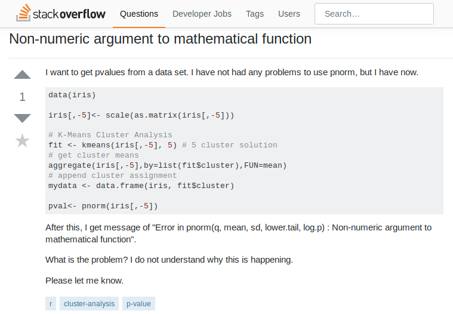

# Roteiro

- Pedindo ajuda

- RStudio

- R base

---

# Pedindo ajuda

1. Documentação do R

2. Google

3. Stack Overflow

4. Colega

---

# Documentação do R

A documentação do R serve para você aprender a usar uma determinada função.

```{r, eval=FALSE}
?mean
help(mean)
```

---

# Pesquisando no google

```{r, error=TRUE}
log("a")
```

<br>


---

# Stack Overflow

O [Stack Overflow](http://stackoverflow.com/) e o [Stack Overflow em Português](http://pt.stackoverflow.com/) são sites de Pergunta e Resposta amplamente utilizados por todas as linguagens de programação e R é uma delas.

--

 
&nbsp; &nbsp; &nbsp; &nbsp; &nbsp; &nbsp; &nbsp;
--


---

# Stack Overflow



---

# Como fazer uma boa pergunta?

No site tem um tutorial com uma lista de boas práticas, [que se encontra aqui](http://pt.stackoverflow.com/help/how-to-ask). 

Algumas dicas são:

* Ser conciso.
* Ser específico.
* Dar um exemplo.
* Ser gentil.

<br>

--


---

# Colega

Se todas as outras alternativas falharam, então procure um colega.


---

background-image: url("img/rstudio.png")
background-position: 50% 50%

