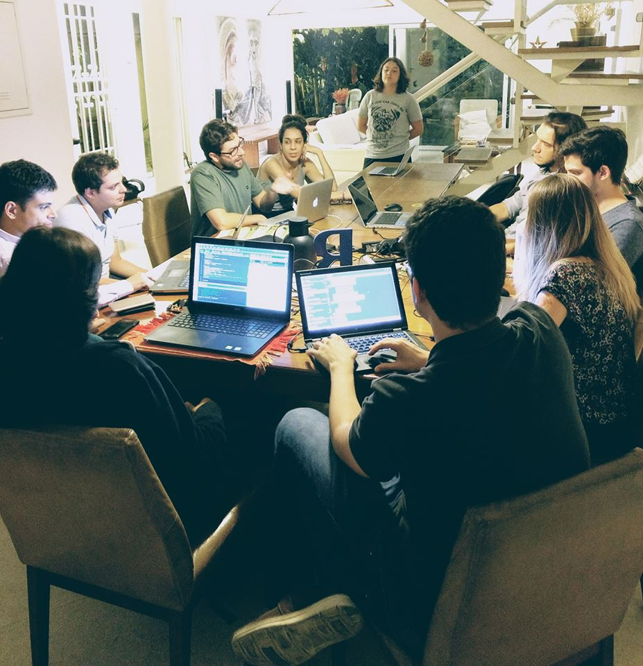
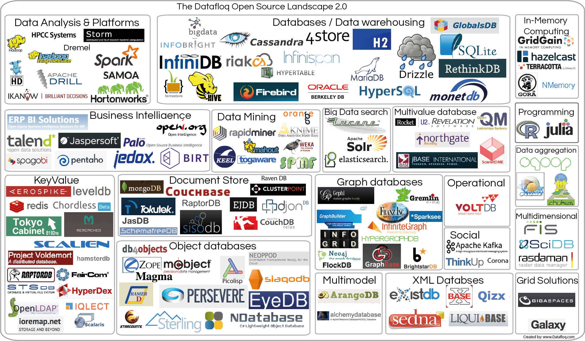
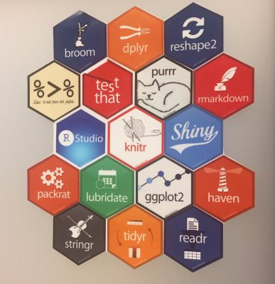

```{r setup, include=FALSE}
options(htmltools.dir.version = FALSE)
```

# Curso-R

- Nosso primeiro curso foi em 2015, no IME-USP.

- A empresa surgiu em 2017.

- Filosofia: código aberto.

- Começamos a receber projetos de consultoria.

- Criamos a R6.

---

# Membros


---

# Datathon



---

# O curso

Nosso curso se baseia no livro [R for data science](http://r4ds.had.co.nz).

Seguimos bastante a ideia por trás do ciclo da ciência de dados:

<br>


---

# Ferramentas para ciência de dados



<center>R é a grande cola!</center> 

---

# Tidyverse: o universo arrumadinho

**Revolução do R**: quem programava em R antes de 2012 nota uma diferença gigante.


---

# Princípios do tidyverse

\> **Eficiência algorítmica vs eficiência de trabalho**

O tempo gasto pensando em como realizar uma operação é mais importante do que o tempo que o computador gasta para realizar um cálculo.

\> **Tidy data**

Princípio para arrumação de base de dados que resolve 90% dos problemas reais. Base tidy:

- Cada observação é uma linha do bd.

- Cada variável é uma coluna do bd.

- Cada dado está numa célula do bd.

\> **Utilização do operador pipe**: `%>%`.

---

# Material do curso

Temos um material em português disponível nesta página:

http://material.curso-r.com/

Também temos um blog:

http://curso-r.com/blog/

---

# GitHub

- Maior plataforma online para compartilhar códigos.

- Utiliza o **Git**, a melhor ferramenta de versionamento de software.

**Vantagens**:

-  Boa prática de organizar projetos, pois mantém os códigos organizados e atualizados na web.

-  Projetos colaborativos: aumenta a produtividade e permite que pessoas de todo lugar ajudem nos projetos. O `tidyverse` só é o que é hoje por conta do *social coding*.

---

# GitHub

Um tutorial para começar a [usar Github no RStudio rapidamente](http://curso-r.com/blog/2017/07/17/2017-07-17-rstudio-e-github/). 

Para detalhes, faça o [data science toolbox](https://www.coursera.org/learn/data-scientists-tools).

---

# Cronograma

* 17/03 - Introdução: `base`

* 17/03 - Importação: `readr`, `readxl`

* 17/03 - Manipulação: `dplyr`, `tidyr`

* 24/03 - Visualização: `ggplot2`

* 24/03 - Case

---

# Dinâmica das aulas

- Intervalo às 21h.

- Aulas expositivas em blocos de 4h.

- Exercícios ao decorrer e no final das aulas.

- Leituras e exercícios complementares fora da sala de aula.

---

# Exercício da aula zero

Guardar:

- Github

- http://material.curso-r.com/

- Tidyverse

- pipe (%>%)

